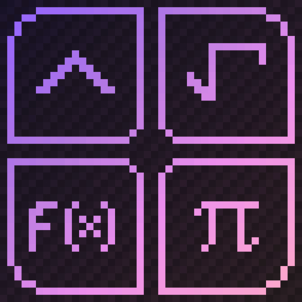

<div align="center">



# ChatCalc Port for (NeoForge 1.21.10)

[](https://www.minecraft.net/)
[](https://neoforged.net/)
[](https://adoptium.net/)
[](LICENSE)
[](https://github.com/Smallinger/ChatCalc-NeoForge/releases)

A Minecraft mod that enables mathematical calculations directly in the chat input field.

</div>

## Overview

ChatCalc NeoForge is a port of the original [ChatCalc Fabric mod](https://github.com/RealRTTV/chatcalc) to NeoForge for Minecraft 1.21.10. This mod allows you to perform mathematical calculations, define custom functions and constants, and execute various mathematical operations without leaving the chat interface.

## Features

- **In-Chat Calculations**: Type mathematical expressions in chat and press TAB to evaluate them
- **Live Preview**: See calculation results in a tooltip above the chat input as you type
- **Custom Functions**: Define and use custom mathematical functions with parameters
- **Custom Constants**: Create named constants for frequently used values
- **Function Management**: List, view, and copy custom functions and constants
- **Click to Copy**: Click on function/constant listings to copy them to clipboard
- **Extensive Math Support**: 
  - Basic operations: +, -, *, /, ^, %
  - Trigonometric functions: sin, cos, tan, asin, acos, atan
  - Logarithmic functions: log, ln
  - Other: sqrt, abs, floor, ceil, round, min, max
  - Summations and products
  - And more!

## Usage

### Basic Calculations
1. Open chat (default: T key)
2. Type a mathematical expression (e.g., `2+2`, `sin(pi/2)`, `sqrt(16)`)
3. Press TAB to evaluate and replace with result

### Custom Functions
Define a custom function:
```
myFunc(x;y) = x^2 + y^2
```
Use it:
```
myFunc(3;4)  // TAB -> 25
```

### Custom Constants
Define a constant:
```
myConst = 42
```
Use it:
```
myConst * 2  // TAB -> 84
```

### Commands
- `functions?` - List all custom functions (click to copy)
- `constants?` - List all custom constants (click to copy)
- `config?` or `cfg?` or `?` - Show configuration help
- `testcases?` - Run internal test cases

### Configuration
The mod creates a `chatcal.json` file in your Minecraft config directory where you can:
- Set decimal format precision
- Toggle radians/degrees mode
- Configure display options
- Manage saved functions and constants

## Installation

1. Install [NeoForge](https://neoforged.net/) for Minecraft 1.21.10
2. Download the ChatCalc NeoForge mod JAR from releases
3. Place the JAR file in your `mods` folder
4. Launch Minecraft

## Building from Source

```bash
./gradlew build
```

The built JAR will be in `build/libs/`

## Credits

- **Original Mod**: [ChatCalc by RealRTTV](https://github.com/RealRTTV/ChatCalc)
- **NeoForge Port**: Smallinger
- **Minecraft Version**: 1.21.10
- **NeoForge Version**: 21.10.49-beta

## License

This project is licensed under the Mozilla Public License Version 2.0 (MPL-2.0).

See the [LICENSE](LICENSE) file for the full license text.

### What this means:
- ✅ You can use this mod freely (including commercially)
- ✅ You can modify and distribute modified versions
- ✅ You must keep the license notices and make source code available
- ✅ Changes must be documented

For more details, see [NOTICE.md](NOTICE.md) for copyright attributions.

## Support My Work

If you like what I do, consider supporting me:

[](https://ko-fi.com/smallpox)

## Differences from Fabric Version

This NeoForge port maintains feature parity with the original Fabric mod while adapting to NeoForge-specific APIs:
- Updated to Minecraft 1.21.10 API changes
- Adapted Mixin implementations for NeoForge
- Updated Component/Chat API usage
- Modified ClickEvent/HoverEvent implementations for new interface-based system

## Support

For issues specific to this NeoForge port, please open an issue on this repository.
For general ChatCalc questions, refer to the [original mod's documentation](https://github.com/RealRTTV/ChatCalc).
